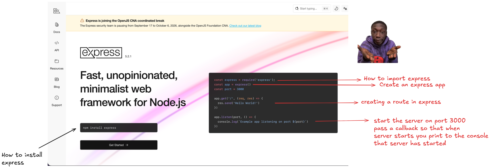
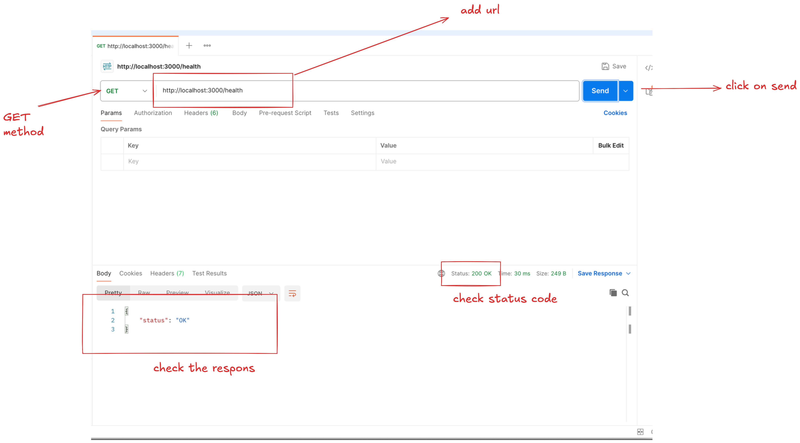
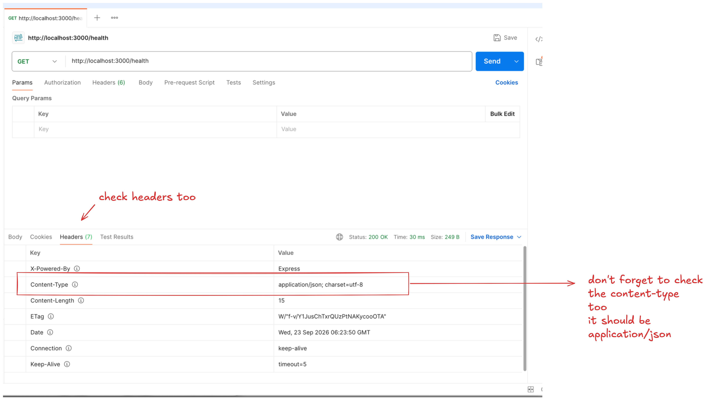
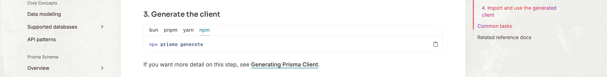
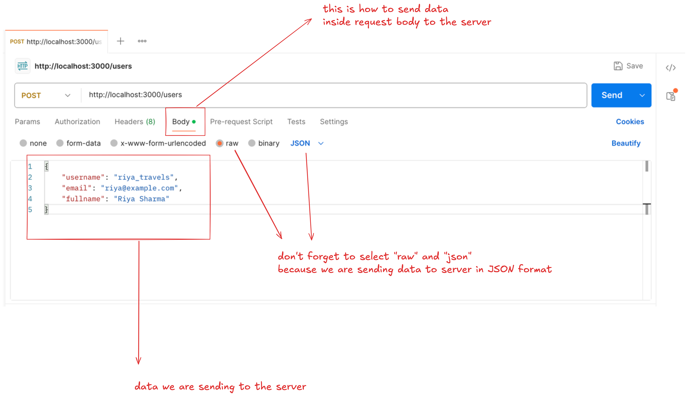
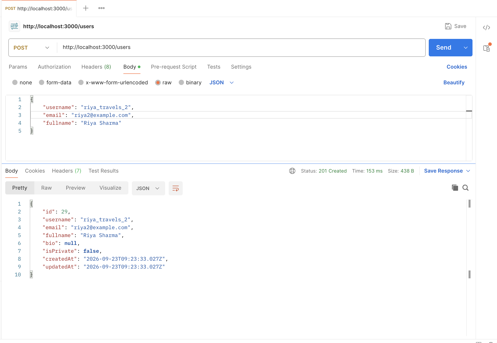
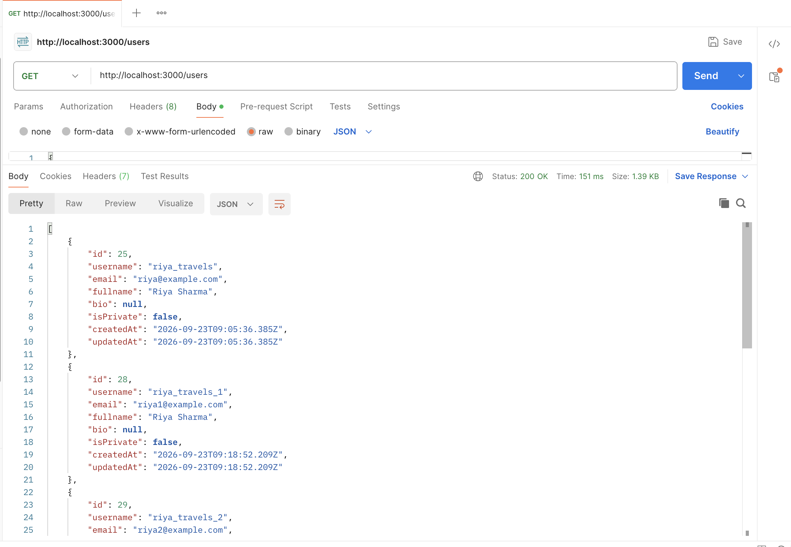
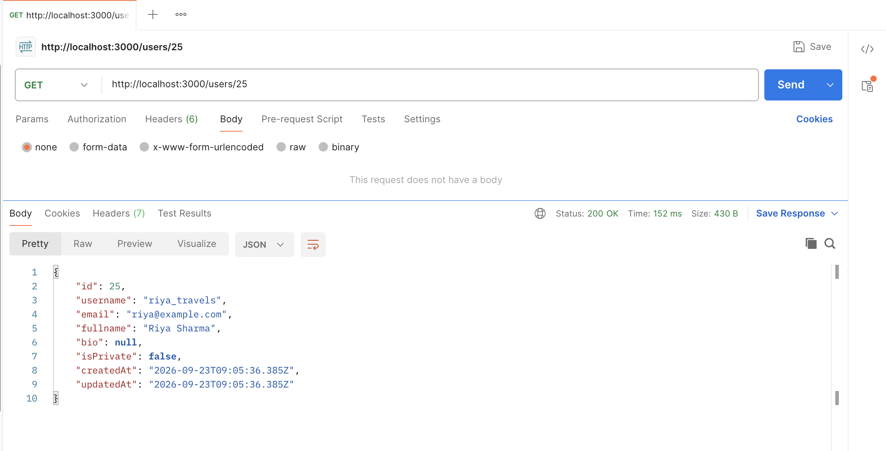
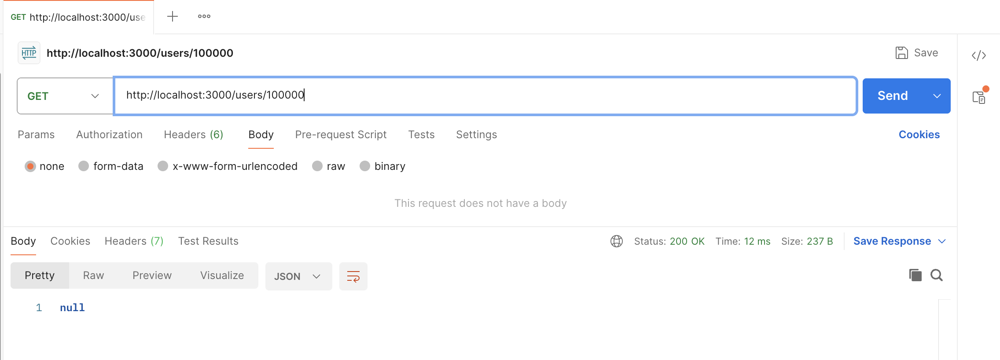
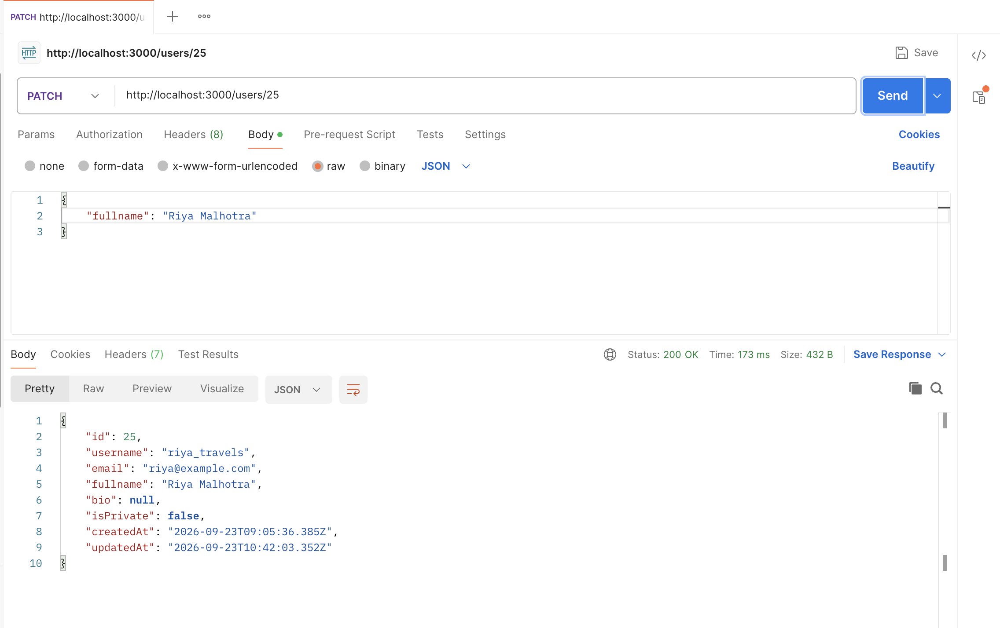

# Solution

## Step 01 - Creating an express server

1. Not giving you a solution on how to create a folder.

Hope you checked the [express doc](https://expressjs.com). Have you?


2. Installing express

```bash:terminal
npm install express
```

3. Importing `express` module.

```js:src/index.js
const express = require("express");
```

4. Create an express app

```js:src/index.js
const express = require("express");
const app = express();
```

5. Create a `GET route`

```js:src/index.js
const express = require("express");
const app = express();

app.get()
```

Now, which URL we need to handle? `/health` right? Add it.

```js:src/index.js
const express = require("express");
const app = express();

app.get("/health")
```

Now, we pass a callback function. Whenever a request lands on our server for `GET /health`, we want this callback function to run.

```js:src/index.js
const express = require("express");
const app = express();

app.get("/health", () => {})
```

In this callback function, we get access to both the `Request` and `Response` objects.

```js:src/index.js
const express = require("express");
const app = express();

app.get("/health", (req, res) => {})
```

We need to respond with a JSON `{ "status": "OK" }`. To do that we will use the `.json` method on the response object.

Since, we can not send objects through the network, we need to convert it to JSON,and to do that, we will use `res.json(object)`

```js:src/index.js
const express = require("express");
const app = express();

app.get("/health", (req, res) => {
  res.json({ status: "OK" })
})
```

> Note, we passed a JavaScript object to `res.json` (no double quotes on the key). `res.json` will convert it to JSON.
>
> `res.json` not only converts to JSON, but also adds a `Content-Type: application/json` header to the response.
>
> `res/json` also sends a status code of 200 by default. So, we don't have to manually add it.

6. Start the server on port 3000.

```js:src/index.js
const express = require("express");
const app = express();

app.get("/health", (req, res) => {
  res.json({ status: "OK" })
})

app.listen(3000);
```

7. When starting the server, it should print `"Server started on port 3000"` on the console. We can achive this by passing a callback function to `app.listen` as the second argument which runs whenever th server starts.

```js:src/index.js
const express = require("express");
const app = express();

app.get("/health", (req, res) => {
  res.json({ status: "OK" })
})

app.listen(3000, () => {
  console.log("Server started on port 3000")
});
```

Now let's test this. I am going to test it on Postman, but interface is same in Insomnia and Thunderclient




## Step 02 - Generate Prisma Client

Have you checked the reference doc correctly? It is written there only, just one command.

[Check the doc again](https://www.prisma.io/docs/orm/v7/prisma-client).


Anyways, here's the command to generate the prisma client.

```bash:terminal
npx prisma generate
```

## Step 03 - Setup prisma client

Have you checked the [documentation](https://www.prisma.io/docs/orm/v7/prisma-client/setup-and-configuration/introduction)?

If you scroll down to ["Importing Prisma Client"](https://www.prisma.io/docs/orm/v7/prisma-client/setup-and-configuration/introduction) section, you will see the code required to setup prisma client.

Just copy it and paste it inside the `src/index.js` file before the express routes.

```diff:src/index.js
const express = require("express");
const app = express();

+import { PrismaClient } from "./path/to/generated/prisma";
+import { PrismaPg } from "@prisma/adapter-pg";

+const adapter = new PrismaPg({
+  connectionString: process.env.DATABASE_URL!,
+});

+export const prisma = new PrismaClient({ adapter });

app.get("/health", (req, res) => {
  res.json({ status: "OK" });
});

app.listen(3000, () => {
  console.log("Server started on port 3000");
});
```

Now, just copy pasting wont work, we need to fix few things.

1. We first have to covert `ESM(import/export)` to `CommonJS(require)` syntax.
2. Fix the import of `PrismaClient` from `import { PrismaClient } from "./path/to/generated/prisma";` to `const { PrismaClient } = require("@prisma/client");`
3. Second we need to remove some TypeScript syntax inside the `connectionString`
4. Don't forget to import `dotenv` module also. `dotenv` will check the `.env` file and populate `process.env` object with required fields. Basically inside `.env` we have `DATABASE_URL` right? `dotenv` will just add this `DATABASE_URL` to `process.env` so that we can access that url string using `process.env.DATABASE_URL`. We don't want anything from `dotenv` library, we just want to import it. So, only requiring it work.

```diff:src/index.js
const express = require("express");
const app = express();

-import { PrismaClient } from "./path/to/generated/prisma";
-import { PrismaPg } from "@prisma/adapter-pg";
+const { PrismaClient } = require("@prisma/client");
+const { PrismaPg } = require("@prisma/adapter-pg");
+require("dotenv/config");

const adapter = new PrismaPg({
-  connectionString: process.env.DATABASE_URL!,
+  connectionString: process.env.DATABASE_URL,
});

-export const prisma = new PrismaClient({ adapter });
+export const prisma = new PrismaClient({ adapter });

app.get("/health", (req, res) => {
  res.json({ status: "OK" });
});

app.listen(3000, () => {
  console.log("Server started on port 3000");
});
```

Now, let's just move all the `require` statements to the top. Just for aesthetics ✨ hehe.
Here's how final `src/index.js` looks like

```js:src/index.js
const express = require("express");
const { PrismaClient } = require("./path/to/generated/prisma");
const { PrismaPg } = require("@prisma/adapter-pg");

const app = express();

const adapter = new PrismaPg({
  connectionString: process.env.DATABASE_URL,
});

const prisma = new PrismaClient({ adapter });

app.get("/health", (req, res) => {
  res.json({ status: "OK" });
});

app.listen(3000, () => {
  console.log("Server started on port 3000");
});
```

Let's now test it using the code writtwen inside `problem.md` file.
Just copy paste it. You don't have to understand it.

```diff:src/index.js
const express = require("express");
const { PrismaClient } = require("@prisma/client");
const { PrismaPg } = require("@prisma/adapter-pg");
require("dotenv/config");

const app = express();

const adapter = new PrismaPg({
  connectionString: process.env.DATABASE_URL,
});

const prisma = new PrismaClient({ adapter });

+async function testConnection() {
+  try {
+    await prisma.$queryRaw`SELECT 1`;

+    console.log("✅ Database connection successful");
+  } catch (error) {
+    console.error("❌ Database connection failed");
+    console.error(error);
+  } finally {
+    await prisma.$disconnect();
+  }
+}

+testConnection();

app.get("/health", (req, res) => {
  res.json({ status: "OK" });
});

app.listen(3000, () => {
  console.log("Server started on port 3000");
});

```

Now run the file using `node src/index.js` and check whether you are getting `"✅ Database connection successful"` inside the console or not.
If you getting the success message you are good to go.
If not, check the above code, check the `DATABASE_URL` inside the `.env` file, check whether you have required modules installed, basically read the error message.

If the test is successful, you can remove the test code.

```diff:src/index.js
const express = require("express");
const { PrismaClient } = require("@prisma/client");
const { PrismaPg } = require("@prisma/adapter-pg");
require("dotenv/config");

const app = express();

const adapter = new PrismaPg({
  connectionString: process.env.DATABASE_URL,
});

const prisma = new PrismaClient({ adapter });

-async function testConnection() {
-  try {
-    await prisma.$queryRaw`SELECT 1`;

-    console.log("✅ Database connection successful");
-  } catch (error) {
-    console.error("❌ Database connection failed");
-    console.error(error);
-  } finally {
-    await prisma.$disconnect();
-  }
-}

-testConnection();

app.get("/health", (req, res) => {
  res.json({ status: "OK" });
});

app.listen(3000, () => {
  console.log("Server started on port 3000");
});

```

## Step 04 - POST /users

Let's start by creating a route `POST /users` inside `src/index.js`

```diff:src/index.js
const express = require("express");
const { PrismaClient } = require("@prisma/client");
const { PrismaPg } = require("@prisma/adapter-pg");
require("dotenv/config");

const app = express();

const adapter = new PrismaPg({
  connectionString: process.env.DATABASE_URL,
});

const prisma = new PrismaClient({ adapter });

app.get("/health", (req, res) => {
  res.json({ status: "OK" });
});

+app.post("/users", (req, res) => {});

app.listen(3000, () => {
  console.log("Server started on port 3000");
});
```

Now, client is going to send the user to create inside the request body, something like below


Now, the question is how we can access this request body? Once we access the request body, then only we will be able to create that user right?

We can access the request body using `req.body`. Let's try to log it and send data using postman and let's see what's get logged to the console.

```js:src/index.js
app.post("/users", (req, res) => {
  console.log(req.body);
});
```

Send POST request and see what is getting logged to the console.

If you check terminal console, you will see `undefined` getting printed.

Why🧐?? This is because we haven't tell express to parse the JSON body in the request.
But how can wee do that? Check the [documentation mention in hints](https://expressjs.com/en/5x/guide/using-middleware/#built-in-middleware).

It shows built-in middlewares. Since, we need to parse JSON, the middleware we need is `express.json()`. Let's add it as a global middleware.

```diff:src/index.js
const express = require("express");
const { PrismaClient } = require("@prisma/client");
const { PrismaPg } = require("@prisma/adapter-pg");
require("dotenv/config");

const app = express();

+app.use(express.json());

const adapter = new PrismaPg({
  connectionString: process.env.DATABASE_URL,
});

const prisma = new PrismaClient({ adapter });

app.get("/health", (req, res) => {
  res.json({ status: "OK" });
});

app.post("/users", (req, res) => {
  console.log(req.body);
});

app.listen(3000, () => {
  console.log("Server started on port 3000");
});
```

Now, restart the server and try to send request and see what is getting logged on the console.
And you will see body getting logged on the console.

```sh
{
  username: 'riya_travels',
  email: 'riya@example.com',
  fullname: 'Riya Sharma'
}
```

Ok, now we are getting the request body, let's try to create a user in the `User` table using prisma.
Again go to the [documentation mentioned in the hints](https://www.prisma.io/docs/orm/v7/prisma-client/queries/crud#create)

We just have to use `prisma.user.create` to create a row in the table.

> One thing to note, the name of the is `User` with capital `U` and not small `u`, we still have to use lowercase in prisma queries like `prisma.user.create` and not `prisma.User.create`.

```diff:src/index.js
app.post("/users", async (req, res) => {
+  await prisma.user.create({
+    data: req.body,
+  });
});
```

Send the request using postman and check database whether row is created or not.

```text
instalite=# SELECT * FROM "User";
 id |   username   |      email       | bio |        createdAt        |        updatedAt        | isPrivate |  fullname
----+--------------+------------------+-----+-------------------------+-------------------------+-----------+-------------
 25 | riya_travels | riya@example.com |     | 2026-09-23 09:05:36.385 | 2026-09-23 09:05:36.385 | f         | Riya Sharma
(1 row)
```

Ok, now we are confirmed our prisma query is correct, let's see the next step. We need to respond with the created user. How are we going to get the created user?

Let's try to see what this `prisma.user.create` returns. Store the result in the variable and log it to the console.

```diff:src/index.js
app.post("/users", async (req, res) => {
-  await prisma.user.create({
-    data: req.body,
-  });
+  const result = await prisma.user.create({
+    data: req.body,
+  });
+  console.log(result);
});
```

Send the request using postman (Dont' forget to change `username` and `email` otherwise, you will get duplicate key error) and check console.

```shell
{
  id: 28,
  username: 'riya_travels_1',
  email: 'riya1@example.com',
  fullname: 'Riya Sharma',
  bio: null,
  isPrivate: false,
  createdAt: 2026-09-23T09:18:52.209Z,
  updatedAt: 2026-09-23T09:18:52.209Z
}
```

Ok, now, we know how to get the newly created user. Let's send this as a JSON response, with status code 201.

```diff:src/index.js
app.post("/users", async (req, res) => {
  const result = await prisma.user.create({
    data: req.body,
  });
-  console.log(result);
+  res.status(201).json(result);
});
```

Again, restart the server, send request and you will see the newly created user in the response.



Ok, now the happy path is done. Let's do some error handling.
Some fields are required. If user does not send those fields, we need to respond with an error message.
For `User` table, `username`, `email` and `fullName` are required. Let's add conditional statement to handle this.

```diff:src/index.js
app.post("/users", async (req, res) => {
+  if (!req.body.username || !req.body.email || !req.body.fullname) {
+    return res
+      .status(400)
+      .json({ error: "username, email and fullname are required" });
+  }

  const result = await prisma.user.create({
    data: req.body,
  });
  res.status(201).json(result);
});
```

Restart the server and test your implementation bu not sending required fields in the request body.

But there is one problem, user can send `id` which we do not want. so we have to delete that property from request body before we give it to prisma.

```diff:src/index.js
app.post("/users", async (req, res) => {
+  delete req.body;

  if (!req.body.username || !req.body.email || !req.body.fullname) {
    return res
      .status(400)
      .json({ error: "username, email and fullname are required" });
  }

  const result = await prisma.user.create({
    data: req.body,
  });
  res.status(201).json(result);
});
```

There is one last thing, we need to handle. If user sends a duplicate `username` or `email`, we have to respond with `409` error.

Now, how we are going to know whether the `username` has been used or not.
First, let's try to send a duplicate `username` and check whats happen.
We get an error.

```text
Invalid `prisma.user.create()` invocation:


Unique constraint failed on the constraint: `User_username_key`
    at vn.handleRequestError (/Users/iamzee/personal/insta-lite/node_modules/@prisma/client/runtime/client.js:65:8643)
    at vn.handleAndLogRequestError (/Users/iamzee/personal/insta-lite/node_modules/@prisma/client/runtime/client.js:65:7932)
    at vn.request (/Users/iamzee/personal/insta-lite/node_modules/@prisma/client/runtime/client.js:65:7639)
    at process.processTicksAndRejections (node:internal/process/task_queues:103:5)
    at async a (/Users/iamzee/personal/insta-lite/node_modules/@prisma/client/runtime/client.js:99:6935)
    at async /Users/iamzee/personal/insta-lite/src/index.js:29:18

```

So, let's handle this error using `try/catch`. If the program flow goes to `catch` block, then means something and wrong and it is most probably the duplicate key one.

```diff:src/index.js
app.post("/users", async (req, res) => {
+  try {
    delete req.body;
    if (!req.body.username || !req.body.email || !req.body.fullname) {
      return res
        .status(400)
        .json({ error: "username, email and fullname are required" });
    }

    const result = await prisma.user.create({
      data: req.body,
    });
    res.status(201).json(result);
+  } catch (err) {
+    res.status(409).json({ error: "username or email already taken" });
+  }
});
```

> Actually this is not the correct way, since we our code can throw error for multiple reasons, not just duplicate key. And for every thrown error, we will responding with the error message `{ error: "username or email already taken" }`, which is not correct. The correct way is to check the error code using `err.code` and then decide what type of error is this. But for our current use case this will work fine.

## Step 05 - GET /users

Just check the [documentation from hints](https://www.prisma.io/docs/orm/v7/prisma-client/queries/crud#read), it is a one line code

```js:src/index.js
app.get("/users", async (req, res) => {
  const result = await prisma.user.findMany();
  res.json(result);
});
```

Restart the server and test your implementation



## Step 06 - GET /users/:id

Now, before we fetch user of the particular id, we first need to access the `id` from the request parameters.
Check [documentation to access request parameters](https://expressjs.com/en/5x/guide/routing/#route-parameters). We can access request params using `req.params.id`

```js:src/index.js
app.get("/users/:id", async (req, res) => {
  const id = req.params.id;
  console.log(id);
});
```

Restart the server, send a request to `/users/1` and check whether `1` is getting logged to the console.

Ok, now we have access to `id`, let's access the user with that id from database using `prisma`.

```diff:src/index.js
app.get("/users/:id", async (req, res) => {
-  const id = req.params.id;
-  console.log(id);
+  const user = await prisma.user.findUnique({
+    where: { id: Number(req.params.id) },
+  });
+  res.json(user);
});
```

> Don't forget to convert `req.params.id` to `Number` since, `id` is of type `Int` in the database and in parameters we get a string.

Restart the server and test it.



One last thing, we need to handle in this is if the user with the given `id` does not exist.

Before we handle that, let's see what prisma returns if user with `id` does not exist. Try sending request to `/users/100000` and check.



So, it returns `null`. We need to respond with `404` and error message if `user` does not exists. So, we need to just add a conditional statement.

```diff:src/index.js
app.get("/users/:id", async (req, res) => {
  const user = await prisma.user.findUnique({
    where: { id: Number(req.params.id) },
  });

+  if (!user) {
+    return res.status(404).json({ error: "User not found" });
+  }

  res.json(user);
});
```

## Step 07 - PATCH /users/:id

[Prisma doc to update a single record](https://www.prisma.io/docs/orm/v7/prisma-client/queries/crud#update)

We extract `id` from parameters, using `req.params.id`, then use `prisma.user.update` to update it based on the `id` we get and whatever data we get in request body.

We also get the updated user as a return value from `prisma.user.update`.

```js:src/index.js
app.patch("/users/:id", async (req, res) => {
  const updatedUser = await prisma.user.update({
    where: { id: Number(req.params.id) },
    data: req.body,
  });
  res.json(updatedUser);
});
```

Restart the server, send the updated field in the request body and test it.



But the problem with this code is it will update all the fields send in request body.
We can not allow that.

We only need to allow `fullname`, `bio`, `isPrivate` to be editable. So, instead of passing `req.body` to `data` field. We extract the required fields from the body.

```diff:src/index.js
app.patch("/users/:id", async (req, res) => {
  const updatedUser = await prisma.user.update({
    where: { id: Number(req.params.id) },
-    data: req.body,
+    data: {
+      fullname: req.body.fullname,
+      bio: req.body.bio,
+      isPrivate: req.body.isPrivate,
    },
  });
  res.json(updatedUser);
});
```

Ok, one last thing we need to handle is handle the `id` for which the user does not exist.

We will do the same trick. First send the request for the `id` that does not exist and see what happens.

It throws an error.

So, we again add `try/catch` to handle users whose `id` does not exist and send `404` for them.

```diff:src/index.js
app.patch("/users/:id", async (req, res) => {
+  try {
    const updatedUser = await prisma.user.update({
      where: { id: Number(req.params.id) },
      data: {
        fullname: req.body.fullname,
        bio: req.body.bio,
        isPrivate: req.body.isPrivate,
      },
    });
    res.json(updatedUser);
+  } catch (err) {
+    res.status(404).json({ error: "User not found" });
+  }
});
```

## Step 08 - DELETE /users/:id

[Documentation to delete a single record](https://www.prisma.io/docs/orm/v7/prisma-client/queries/crud#delete)

```js:src/index.js
app.delete("/users/:id", async (req, res) => {
  await prisma.user.delete({
    where: {
      id: Number(req.params.id),
    },
  });
  res.status(204).send();
});
```

We delete the user with the given `id` using the `where` clause.

And since we need to send a different status code `204`, we use `res.status` and empty `send()`

Restart the server and send the request and check the database where row get deleted or not.

Last thing to handle is if the user with the given id does not exist.

Again, we will handle it using `try/catch`.

```diff:src/index.js
app.delete("/users/:id", async (req, res) => {
+  try {
    await prisma.user.delete({
      where: {
        id: Number(req.params.id),
      },
    });
    res.status(204).send();
+  } catch (err) {
+    res.status(404).json({ error: "User not found" });
+  }
});
```

## Step 09 - Refactor: shared Prisma Client in `src/db.js`

We need to move Prisma Client to another file `src/db.js`.

Let's do that will all the necessary imports. First copy all the prisma code from `src/index.js` and move it to `src/db.js`

```diff:src/db.js
+const { PrismaClient } = require("@prisma/client");
+const { PrismaPg } = require("@prisma/adapter-pg");
+require("dotenv/config");
+
+const adapter = new PrismaPg({
+  connectionString: process.env.DATABASE_URL,
+});
+
+const prisma = new PrismaClient({ adapter });
+
+module.exports = prisma;
```

Then delete the copied code from `src/index.js`

```diff:src/index.js
const express = require("express");
-const { PrismaClient } = require("@prisma/client");
-const { PrismaPg } = require("@prisma/adapter-pg");
-require("dotenv/config");

const app = express();

app.use(express.json());

-const adapter = new PrismaPg({
-  connectionString: process.env.DATABASE_URL,
-});

-const prisma = new PrismaClient({ adapter });

app.get("/health", (req, res) => {
  res.json({ status: "OK" });
});

...

app.listen(3000, () => {
  console.log("Server started on port 3000");
});
```

After deleting, dont' forget to import `prisma` from `src/db.js`

```diff:src/index.js
const express = require("express");
+const prisma = require("./db");

const app = express();

app.use(express.json());

app.get("/health", (req, res) => {
  res.json({ status: "OK" });
});

...

app.listen(3000, () => {
  console.log("Server started on port 3000");
});

```

## Step 10 - Refactor: Users routes in `src/routes/users.routes.js`

Let's use the [Express router documentation](https://expressjs.com/en/5x/guide/routing/#approute) to refactor routes to `src/routes/users.routes.js` file

First create the file `src/routes/users.rotues.js`

First just cut paste all the user rotues to that file.

```js:src/routes/users.routes.js
app.post("/users", async (req, res) => {
  try {
    delete req.body;
    if (!req.body.username || !req.body.email || !req.body.fullname) {
      return res
        .status(400)
        .json({ error: "username, email and fullname are required" });
    }

    const result = await prisma.user.create({
      data: req.body,
    });
    res.status(201).json(result);
  } catch (err) {
    res.status(409).json({ error: "username or email already taken" });
  }
});

app.get("/users", async (req, res) => {
  const result = await prisma.user.findMany();
  res.json(result);
});

app.get("/users/:id", async (req, res) => {
  const user = await prisma.user.findUnique({
    where: { id: Number(req.params.id) },
  });

  if (!user) {
    return res.status(404).json({ error: "User not found" });
  }

  res.json(user);
});

app.patch("/users/:id", async (req, res) => {
  try {
    const updatedUser = await prisma.user.update({
      where: { id: Number(req.params.id) },
      data: {
        fullname: req.body.fullname,
        bio: req.body.bio,
        isPrivate: req.body.isPrivate,
      },
    });
    res.json(updatedUser);
  } catch (err) {
    res.status(404).json({ error: "User not found" });
  }
});

app.delete("/users/:id", async (req, res) => {
  try {
    await prisma.user.delete({
      where: {
        id: Number(req.params.id),
      },
    });
    res.status(204).send();
  } catch (err) {
    res.status(404).json({ error: "User not found" });
  }
});

```

Now, since we are using an express router. Let's import it and use that.
Instead of `app.get` and `app.post`, use `router.get` and `router.post`.

Also don't forget to import `prisma` from `src/db.js`, since we are using that in this file.

```diff:src/routes/users.routes.js
+const express = require("express");
+const router = express.Router();
+const prisma = require("../db");

-app.post("/users", async (req, res) => {
+router.post("/users", async (req, res) => {
  try {
    delete req.body;
    if (!req.body.username || !req.body.email || !req.body.fullname) {
      return res
        .status(400)
        .json({ error: "username, email and fullname are required" });
    }

    const result = await prisma.user.create({
      data: req.body,
    });
    res.status(201).json(result);
  } catch (err) {
    res.status(409).json({ error: "username or email already taken" });
  }
});

-app.get("/users", async (req, res) => {
+router.get("/users", async (req, res) => {
  const result = await prisma.user.findMany();
  res.json(result);
});

-app.get("/users/:id", async (req, res) => {
+router.get("/users/:id", async (req, res) => {
  const user = await prisma.user.findUnique({
    where: { id: Number(req.params.id) },
  });

  if (!user) {
    return res.status(404).json({ error: "User not found" });
  }

  res.json(user);
});

-app.patch("/users/:id", async (req, res) => {
+router.patch("/users/:id", async (req, res) => {
  try {
    const updatedUser = await prisma.user.update({
      where: { id: Number(req.params.id) },
      data: {
        fullname: req.body.fullname,
        bio: req.body.bio,
        isPrivate: req.body.isPrivate,
      },
    });
    res.json(updatedUser);
  } catch (err) {
    res.status(404).json({ error: "User not found" });
  }
});

-app.delete("/users/:id", async (req, res) => {
+router.delete("/users/:id", async (req, res) => {
  try {
    await prisma.user.delete({
      where: {
        id: Number(req.params.id),
      },
    });
    res.status(204).send();
  } catch (err) {
    res.status(404).json({ error: "User not found" });
  }
});

+module.exports = router;
```

Let's use this exported router inside `src/index.js`.

```diff:src/idnex.js
const express = require("express");
-const prisma = require("./db");
+const usersRouter = require("./routes/users.routes");

const app = express();

app.use(express.json());

+app.use(usersRouter);

app.get("/health", (req, res) => {
  res.json({ status: "OK" });
});

app.listen(3000, () => {
  console.log("Server started on port 3000");
});
```

Also, we can do one more refactor. Inside `src/routes/users.routes.js`, we are repeating ourselves like `router.get("/users")`, `router.post("/users")`

All routes inside this file start from `"/users"`, let's extract this inside `src/index.js`

```diff:src/index.js
const express = require("express");
const usersRouter = require("./routes/users.routes");

const app = express();

app.use(express.json());

-app.use(usersRouter);
+app.use("/users", usersRouter);

app.get("/health", (req, res) => {
  res.json({ status: "OK" });
});

app.listen(3000, () => {
  console.log("Server started on port 3000");
});
```

```diff:src/routes/users.routes.js
const express = require("express");
const router = express.Router();
const prisma = require("../db");

-router.post("/users", async (req, res) => {
+router.post("/", async (req, res) => {
  try {
    delete req.body;
    if (!req.body.username || !req.body.email || !req.body.fullname) {
      return res
        .status(400)
        .json({ error: "username, email and fullname are required" });
    }

    const result = await prisma.user.create({
      data: req.body,
    });
    res.status(201).json(result);
  } catch (err) {
    res.status(409).json({ error: "username or email already taken" });
  }
});

-router.get("/users", async (req, res) => {
+router.get("/", async (req, res) => {
  const result = await prisma.user.findMany();
  res.json(result);
});

router.get("/:id", async (req, res) => {
  const user = await prisma.user.findUnique({
    where: { id: Number(req.params.id) },
  });

  if (!user) {
    return res.status(404).json({ error: "User not found" });
  }

  res.json(user);
});

-router.patch("/users/:id", async (req, res) => {
+router.patch("/:id", async (req, res) => {
  try {
    const updatedUser = await prisma.user.update({
      where: { id: Number(req.params.id) },
      data: {
        fullname: req.body.fullname,
        bio: req.body.bio,
        isPrivate: req.body.isPrivate,
      },
    });
    res.json(updatedUser);
  } catch (err) {
    res.status(404).json({ error: "User not found" });
  }
});

-router.delete("/users/:id", async (req, res) => {
+router.delete("/:id", async (req, res) => {
  try {
    await prisma.user.delete({
      where: {
        id: Number(req.params.id),
      },
    });
    res.status(204).send();
  } catch (err) {
    res.status(404).json({ error: "User not found" });
  }
});

module.exports = router;
```

## Step 11 - Refactor: controllers in `src/controllers/users.controller.js`

Firstly, create a file `src/controllers/users.controllers.js

Now, lets start with `POST /users` route. Cut the route handler for this route from `src/routes/users.routes.js` and paste it in `users.controllers.js` and call that function `create`. Also don't forget to import `prisma`

```js:src/controllers/users.controllers.js
const prisma = require("../db");

let create = async (req, res) => {
  try {
    delete req.body;
    if (!req.body.username || !req.body.email || !req.body.fullname) {
      return res
        .status(400)
        .json({ error: "username, email and fullname are required" });
    }

    const result = await prisma.user.create({
      data: req.body,
    });
    res.status(201).json(result);
  } catch (err) {
    res.status(409).json({ error: "username or email already taken" });
  }
};

module.exports = { create };
```

And use this function inside `/src/routes/users.routes.js

```diff:src/routes/users.routes.js
+const { create } = require("../controllers/users.controllers");

-router.post("/", async (req, res) => {
-  try {
-    delete req.body;
-    if (!req.body.username || !req.body.email || !req.body.fullname) {
-      return res
-        .status(400)
-        .json({ error: "username, email and fullname are required" });
-    }
-
-    const result = await prisma.user.create({
-      data: req.body,
-    });
-    res.status(201).json(result);
-  } catch (err) {
-    res.status(409).json({ error: "username or email already taken" });
-  }
-});

+router.post("/", create);
```

Now, do this with all the other routes.

```js:src/routes.users.routes.js
const express = require("express");
const router = express.Router();

const {
  create,
  list,
  getOne,
  update,
  remove,
} = require("../controllers/users.controllers");

router.post("/", create);
router.get("/", list);
router.get("/:id", getOne);
router.patch("/:id", update);
router.delete("/:id", remove);

module.exports = router;
```

```js:src/controllers.users.controllers.js
const prisma = require("../db");

let create = async (req, res) => {
  try {
    delete req.body;
    if (!req.body.username || !req.body.email || !req.body.fullname) {
      return res
        .status(400)
        .json({ error: "username, email and fullname are required" });
    }

    const result = await prisma.user.create({
      data: req.body,
    });
    res.status(201).json(result);
  } catch (err) {
    res.status(409).json({ error: "username or email already taken" });
  }
};

const list = async (req, res) => {
  const result = await prisma.user.findMany();
  res.json(result);
};

const getOne = async (req, res) => {
  const user = await prisma.user.findUnique({
    where: { id: Number(req.params.id) },
  });

  if (!user) {
    return res.status(404).json({ error: "User not found" });
  }

  res.json(user);
};

const update = async (req, res) => {
  try {
    const updatedUser = await prisma.user.update({
      where: { id: Number(req.params.id) },
      data: {
        fullname: req.body.fullname,
        bio: req.body.bio,
        isPrivate: req.body.isPrivate,
      },
    });
    res.json(updatedUser);
  } catch (err) {
    res.status(404).json({ error: "User not found" });
  }
};

const remove = async (req, res) => {
  try {
    await prisma.user.delete({
      where: {
        id: Number(req.params.id),
      },
    });
    res.status(204).send();
  } catch (err) {
    res.status(404).json({ error: "User not found" });
  }
};

module.exports = { create, list, getOne, update, remove };
```

## Step 12 - Refactor: services in `src/services/users.service.js`

Create `src/services/users.service.js`

Let's try to refactor `create` controller function.

Copy the prisma code inside that function and paste it in service file.

Don't forget to import the `prisma` and since our prisma query needs `req.body`, replace it with the data being passed by the controller as we can't use `req` inside the service.

```js:src/services/users.service.js
const prisma = require("../db");

const createUser = async (data) => {
  const result = await prisma.user.create({
    data,
  });
  return result;
};

module.exports = { createUser };
```

```diff:src/controllers/users.controllers.js
+const { createUser } = require("../services/users.service");

let create = async (req, res) => {
  try {
    delete req.body;
    if (!req.body.username || !req.body.email || !req.body.fullname) {
      return res
        .status(400)
        .json({ error: "username, email and fullname are required" });
    }

-    const result = await prisma.user.create({
-      data: req.body,
-    });
+    const result = await createUser(req.body);
    res.status(201).json(result);
  } catch (err) {
    res.status(409).json({ error: "username or email already taken" });
  }
};
```

Let's do this with every route

```diff:src/controllers/users.controllers.js
-const prisma = require("../db");

-const { createUser } = require("../services/users.service");

+const {
+  createUser,
+  listUser,
+  getUserById,
+  updateUser,
+  deleteUser,
+} = require("../services/users.service");


let create = async (req, res) => {
  try {
    delete req.body;
    if (!req.body.username || !req.body.email || !req.body.fullname) {
      return res
        .status(400)
        .json({ error: "username, email and fullname are required" });
    }

    const result = await createUser(req.body);
    res.status(201).json(result);
  } catch (err) {
    res.status(409).json({ error: "username or email already taken" });
  }
};

const list = async (req, res) => {
-  const result = await prisma.user.findMany();
+  const result = await listUser();
  res.json(result);
};

const getOne = async (req, res) => {
-  const user = await prisma.user.findUnique({
-    where: { id: Number(req.params.id) },
-  });

+  const user = await getUserById(Number(req.params.id));

  if (!user) {
    return res.status(404).json({ error: "User not found" });
  }

  res.json(user);
};

const update = async (req, res) => {
  try {
-    const updatedUser = await prisma.user.update({
-      where: { id: Number(req.params.id) },
-      data: {
-        fullname: req.body.fullname,
-        bio: req.body.bio,
-        isPrivate: req.body.isPrivate,
-      },
-    });

+    const updatedUser = await updateUser(Number(req.params.id), {
+      fullname: req.body.fullname,
+      bio: req.body.bio,
+      isPrivate: req.body.isPrivate,
+    });
    res.json(updatedUser);
  } catch (err) {
    res.status(404).json({ error: "User not found" });
  }
};

const remove = async (req, res) => {
  try {
-    await prisma.user.delete({
-      where: {
-        id: Number(req.params.id),
-      },
-    });
+    await deleteUser(Number(req.params.id));
    res.status(204).send();
  } catch (err) {
    res.status(404).json({ error: "User not found" });
  }
};

module.exports = { create, list, getOne, update, remove };
```

```js:src/services/users.service.js
const prisma = require("../db");

const createUser = async (data) => {
  const result = await prisma.user.create({
    data,
  });
  return result;
};

const listUser = async () => {
  return await prisma.user.findMany();
};

const getUserById = async (id) => {
  return await prisma.user.findUnique({
    where: { id },
  });
};

const updateUser = async (id, data) => {
  return await prisma.user.update({
    where: { id },
    data,
  });
};

const deleteUser = async (id) => {
  return await prisma.user.delete({
    where: {
      id,
    },
  });
};

module.exports = { createUser, listUser, getUserById, updateUser, deleteUser };
```